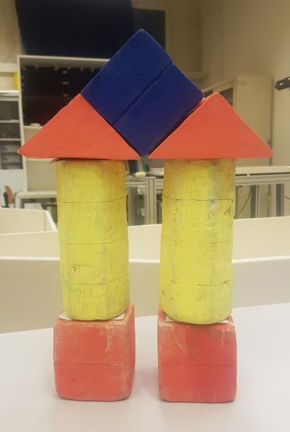
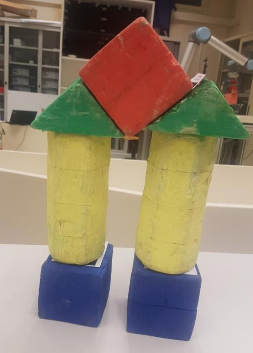

# Homework 4 - System integration

Integrate the system implementing, for example, a Finite State Machine that allows Marrtino and UR5 to cooperate with
each other in order to solve Homework 1, 2, and 3 simultaneously.

The integration is simply a set of ROS actions and services letting the two robots communicate
their states (e.g., *the docking behavior is completed*) and cooperate according to these states. Thus,
students will start the total behavior and, after the *Start*, the two robots have to complete the global task
in an autonomous mode. The human intervention is not allowed after the *Start*, apart from unloading the
pieces from the top of the mobile robot (when in the docking station) and advise this robot that this
unload is completed.

<table>
<tr><td> </td><td>  </td></tr>
Figure 1 - The assembly tasks
</table>

The total behavior follows:

- select one and only one of the tasks of Figure 1;
- start the Finite State Machine giving as inputs the names of the objects composing the selected assembly task;
- in an autonomous mode, Kinect, Marrtino, and the UR5 manipulator robot,  have to
  1.  Detect the objects;
  2.  Pick the objects;
  3.  Place the objects on the mobile robot, previously docked in the free docking station near the
manipulator robot.
- Marrtino has to navigate inside the arena until coming back to its start pose;
- From that pose, a student can unload the pieces from the top of the mobile robot and advise
that the unload is done.

The routine has to be repeated until all pieces of the assigned assembly composition have been carried
to the final docking station.

Suggestion: pile the pieces on the top of the mobile robot in an efficient way!

